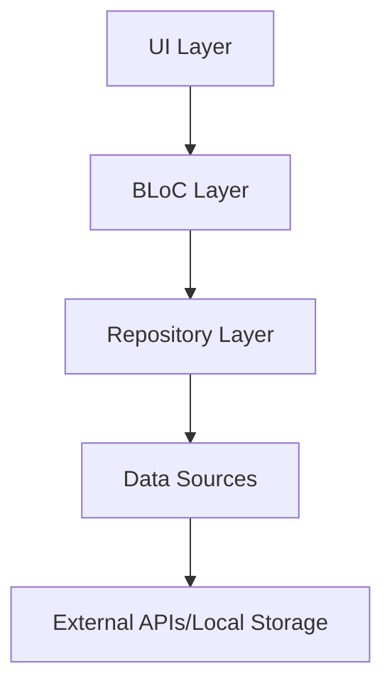
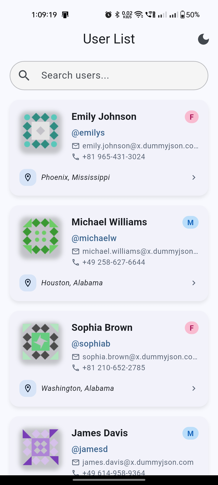
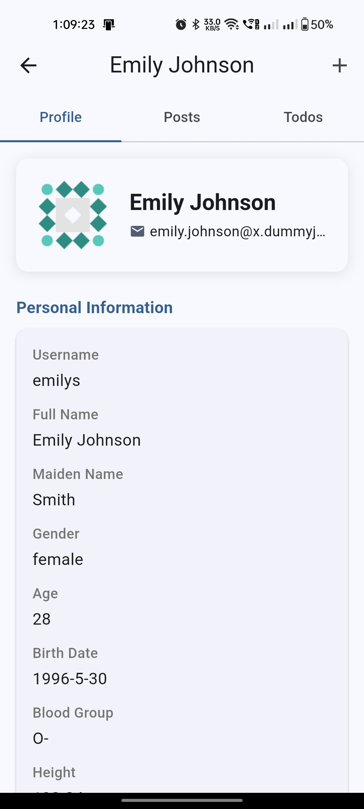
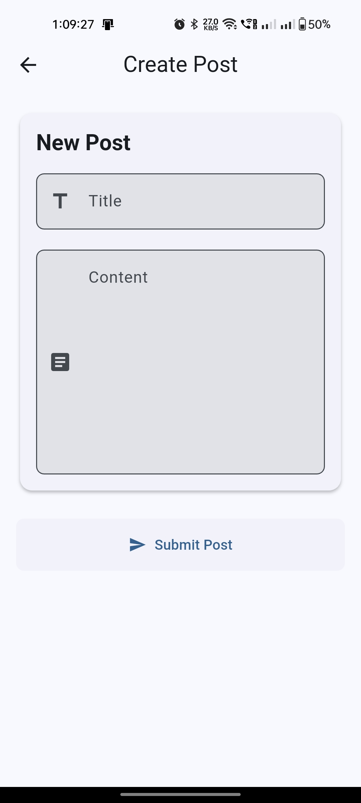

# 🚀 Flutter User Management App

<div align="center">
  


</div>

<p align="center">A modern, responsive Flutter application for user management with clean architecture and elegant UI</p>

## ✨ Project Overview

This Flutter application showcases advanced mobile development practices through a comprehensive user management system. Built with a focus on clean architecture and modern UI/UX principles.

### 🔍 Key Features

- **🔄 Infinite Scrolling** - Smooth user list with dynamic loading
- **🔎 Smart Search** - Find users instantly with real-time filtering
- **👤 Detailed User Profiles** - Comprehensive view of user information
- **📝 Post Management** - View user posts and create new ones
- **✅ Todo Tracking** - Monitor user tasks and completion status
- **🌙 Theme Switching** - Toggle between light and dark modes
- **⚡ Offline Support** - Basic functionality when offline

## 🏗️ Architecture

The application is built on a solid foundation of clean architecture principles:



### Core Components

| Layer                 | Components           | Role                                |
| --------------------- | -------------------- | ----------------------------------- |
| **🎨 Presentation**   | Screens, Widgets     | UI components and user interaction  |
| **🧠 Business Logic** | BLoCs                | State management and business rules |
| **📚 Data**           | Repositories, Models | Data handling and business objects  |
| **🔌 External**       | API Client, Storage  | External services integration       |

## 🚀 Getting Started

### Prerequisites

- Flutter SDK (Latest stable version)
- Dart SDK
- Android Studio / VS Code with Flutter extensions
- An emulator or physical device

### Installation

1. Clone the repository:

   ```bash
   git clone https://github.com/sculptorofcode/User-Management-System-Using-DummyJson-API.git
   ```

2. Navigate to the project directory:

   ```bash
   cd 'User-Management-System-Using-DummyJson-API'
   ```

3. Install dependencies:

   ```bash
   flutter pub get
   ```

4. Run the app:
   ```bash
   flutter run
   ```

## 📚 Resources

<div align="center">
  
[](https://dummyjson.com/docs)
[](https://bloclibrary.dev)

</div>

## 📱 Screenshots

<div align="center">
  <table>
    <tr>
      <td align="center"><strong>User List</strong></td>
      <td align="center"><strong>User Details</strong></td>
      <td align="center"><strong>Create Post</strong></td>
    </tr>
    <tr>
      <td></td>
      <td></td>
      <td></td>
    </tr>
  </table>
</div>

## 🛠️ Tech Stack

<div align="center">
  
  
  
  
  
  
</div>

- **Flutter** – UI framework
- **Dart** – Programming language
- **BLoC Pattern** – State management
- **Hive** – Local storage
- **HTTP** – API communication
- **Provider** – Dependency injection

## 👨‍💻 Development

```text
lib/
├── blocs/          # State management
├── models/         # Data models
├── repositories/   # Data sources
├── screens/        # UI screens
├── utils/          # Utilities
└── widgets/        # Reusable UI components
```

## 📄 License

This project is licensed under the MIT License - see the LICENSE file for details.

## 🙏 Acknowledgements

- [Flutter Team](https://flutter.dev) for the amazing framework
- [DummyJSON](https://dummyjson.com) for providing test APIs
